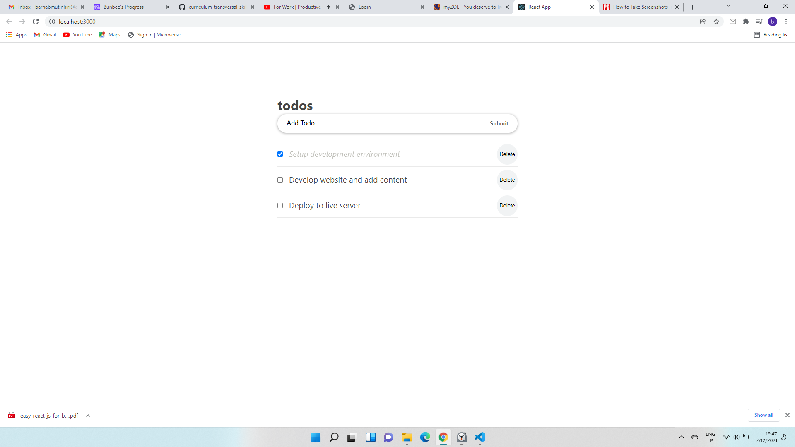

#Screenshot

# Todo List Project App

In this project, i will be creating a React Todo App
In this project i implement App based Components for the application to be component based 
This project was bootstrapped with [Create React App](https://github.com/facebook/create-react-app).

## Built with

React technology 

## Available Scripts

In the project directory, you can run:

### `npm start`

Runs the app in the development mode.\
Open [http://localhost:3000](http://localhost:3000) to view it in the browser.

### `npm run build`

The page will reload if you make edits.\
You will also see any lint errors in the console.

# Authors

- GitHub: [Bunbee](https://github.com/mutinhiri).
- Twitter: [@Bunbee02](https://twitter.com/Bunbee02).
- LinkedIn: [@bunbee](https://www.linkedin.com/in/bunbee).

# Contributing

Contributions, issues, and feature requests are welcome!

Feel free to check the [issues page](https://github.com/mutinhiri/Leaderboard/issues).

# Show your support

Give a :star: if you like this project!